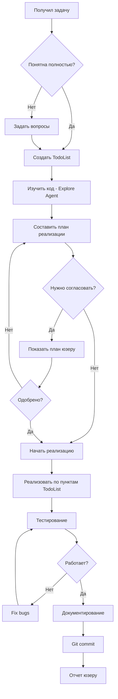

# Универсальная методология работы с Claude Code

## 📋 Оглавление

1. [Начальная настройка проекта](#начальная-настройка-проекта)
2. [Глобальные vs Локальные настройки](#глобальные-vs-локальные-настройки) ⭐ НОВОЕ
3. [Структура документации](#структура-документации)
4. [Стиль общения и промпты](#стиль-общения-и-промпты)
5. [Процесс работы в каждой сессии](#процесс-работы-в-каждой-сессии)
6. [Управление контекстом](#управление-контекстом)
7. [Разбивка и планирование задач](#разбивка-и-планирование-задач)
8. [Работа с агентами](#работа-с-агентами)
9. [Git workflow и деплой](#git-workflow-и-деплой)
10. [Критические правила](#критические-правила)
11. [Чеклисты](#чеклисты)

---

## 🎯 Начальная настройка проекта

### Обязательные файлы

При создании нового проекта **СРАЗУ** создай эти файлы:

```
project-root/
├── CLAUDE.md                    # Главный файл инструкций для Claude
├── README.md                    # Описание проекта для людей
├── TECHNICAL_DOCS.md            # Техническая документация
├── DESIGN_RULES.md              # Критические правила дизайна (НЕ ТРОГАТЬ)
├── PROJECT_HISTORY.md           # История развития проекта
├── TODO.md                      # Долгосрочные задачи и планы
└── docs/
    ├── FEATURES.md              # Описание фич
    ├── ARCHITECTURE.md          # Архитектура системы
    └── API.md                   # API документация (если есть)
```

### Первая сессия с новым проектом

**Шаг 1:** Создай CLAUDE.md
```markdown
# CLAUDE.md

## Project Overview
[Кратко: что это, для чего, основные технологии]

## Development Commands
[npm start, build, test, deploy и т.д.]

## Architecture Overview
[Точки входа, структура папок, data flow]

## Critical Design Rules
[Что НИКОГДА нельзя менять без согласования]

## Environment Variables
[Какие переменные нужны]

## Common Pitfalls
[Частые ошибки и как их избежать]
```

**Шаг 2:** Настрой Output Style

Создай файл `.claude/settings.json` (или добавь в CLAUDE.md):
```markdown
# Output Style: russian-technical-helper

[Скопируй секцию из настоящего CLAUDE.md]
```

**Шаг 3:** Первый коммит
```bash
git init
git add .
git commit -m "Initial project setup with Claude workflow"
```

---

## 🌍 Глобальные vs Локальные настройки

### Два уровня конфигурации Claude Code

Claude Code позволяет настраивать поведение на **двух уровнях**:

| Уровень | Где хранится | Область действия | Когда использовать |
|---------|--------------|------------------|-------------------|
| **Глобальные** | `~/.claude/` | ВСЕ проекты | Общие правила работы, стиль общения, универсальные команды |
| **Локальные** | `project-root/.claude/` | Только текущий проект | Специфичные для проекта команды, настройки |

### Структура глобальных настроек

```
~/.claude/
├── output-styles/          # Стили общения (применяются ко всем проектам)
│   └── russian-technical-helper.md
├── commands/               # Глобальные slash commands
│   └── formattask.md       # Команда /formattask доступна везде
├── settings.local.json     # Глобальные разрешения (permissions)
└── projects/               # История сессий по проектам
    └── -Users-sergey-project-name/
```

### Структура локальных настроек проекта

```
project-root/.claude/
├── commands/               # Команды только для этого проекта
│   ├── deploy.md          # Специфичная команда /deploy
│   └── test-feature.md    # /test-feature для тестирования фичи
└── prompts/               # (опционально) Переиспользуемые промпты
```

### Что настроить ГЛОБАЛЬНО (один раз навсегда)

#### 1. Output Style - Стиль общения

**Файл:** `~/.claude/output-styles/russian-technical-helper.md`

**Что делает:**
- Задаёт язык общения (русский)
- Определяет структуру ответов (WHERE, HOW, WHY)
- Устанавливает приоритеты (документация, образовательный подход)
- **КРИТИЧНО:** Включает правила проактивного форматирования задач

**Создание:**
```bash
# Уже создан, но можно редактировать:
code ~/.claude/output-styles/russian-technical-helper.md
```

**Результат:** Применяется автоматически во ВСЕХ проектах!

#### 2. Команда /formattask - Форматирование задач

**Файл:** `~/.claude/commands/formattask.md`

**Что делает:**
- Берёт неформальную задачу
- Читает CLAUDE.md, DESIGN_RULES.md проекта
- Применяет формулу: ЗАДАЧА + КОНТЕКСТ + ТРЕБОВАНИЯ + ОГРАНИЧЕНИЯ + КРИТЕРИИ
- Генерирует уточняющие вопросы
- Возвращает структурированный промпт

**Использование:**
```
/formattask Надо добавить авторизацию пользователей
```

**Результат:** Команда доступна в ЛЮБОМ проекте!

#### 3. Permissions - Разрешения

**Файл:** `~/.claude/settings.local.json`

**Что делает:**
- Предварительно одобряет часто используемые команды (git, npm, и т.д.)
- Избавляет от постоянных запросов подтверждения

**Пример:**
```json
{
  "permissions": {
    "allow": [
      "Bash(git add:*)",
      "Bash(git commit:*)",
      "Bash(npm install:*)",
      "Bash(npm test)"
    ]
  }
}
```

### Дополнительные глобальные команды (рекомендуется)

Создай эти команды в `~/.claude/commands/` для использования во всех проектах:

#### /plan - Планирование реализации

```bash
# ~/.claude/commands/plan.md
```

**Что делает:**
- Анализирует задачу
- Изучает архитектуру проекта
- Создаёт детальный план с TodoList
- Оценивает риски и сложность

**Использование:**
```
/plan Добавить real-time синхронизацию данных через WebSocket
```

#### /review - Проверка перед коммитом

```bash
# ~/.claude/commands/review.md
```

**Что делает:**
- Проверяет последние изменения (git diff)
- Анализирует код на ошибки
- Проверяет соответствие DESIGN_RULES.md
- Проверяет наличие тестов
- Проверяет обновление документации

**Использование:**
```
/review
```

#### /doc - Автоматическое документирование

```bash
# ~/.claude/commands/doc.md
```

**Что делает:**
- Анализирует последние изменения
- Генерирует документацию для TECHNICAL_DOCS.md
- Обновляет README.md (если публичная фича)
- Проверяет, нужно ли обновить DESIGN_RULES.md

**Использование:**
```
/doc
```

### Что настроить ЛОКАЛЬНО (для конкретного проекта)

#### Специфичные команды проекта

**Пример: Команда /deploy для конкретного проекта**

```bash
# project-root/.claude/commands/deploy.md
```

```markdown
# Deploy to GitHub Pages

Выполни стандартный workflow деплоя для Nastia Calendar:

1. Запусти тесты: `npm test`
2. Создай production build: `npm run build`
3. Задеплой на GitHub Pages: `npm run deploy`
4. Проверь, что сайт доступен: https://segigu.github.io/nastia-calendar/

Если на любом шаге возникла ошибка - останавливайся и сообщи.
```

**Использование:**
```
/deploy
```

### Взаимодействие глобальных и локальных настроек

**Приоритеты:**
1. **Локальные настройки переопределяют глобальные** (если конфликт)
2. **Output Style:** Глобальный применяется, но CLAUDE.md проекта может дополнить
3. **Команды:** Локальные и глобальные доступны одновременно

**Пример:**
- Глобально: `/formattask` (для всех проектов)
- Локально: `/deploy` (только для nastia-simple)
- Результат: В nastia-simple доступны **ОБЕ** команды!

### Быстрая проверка настроек

**Проверить глобальные настройки:**
```bash
# Output Styles
ls -la ~/.claude/output-styles/

# Глобальные команды
ls -la ~/.claude/commands/

# Разрешения
cat ~/.claude/settings.local.json
```

**Проверить локальные настройки проекта:**
```bash
# В корне проекта
ls -la .claude/commands/
```

### Рекомендованная стратегия

**ГЛОБАЛЬНО настрой:**
1. ✅ Output Style (russian-technical-helper) - уже настроен!
2. ✅ `/formattask` - форматирование задач - уже создан!
3. ✅ Permissions для git, npm, bash - проверь settings.local.json
4. ⏳ `/plan` - планирование (опционально)
5. ⏳ `/review` - проверка кода (опционально)
6. ⏳ `/doc` - документирование (опционально)

**ЛОКАЛЬНО в каждом проекте:**
1. ✅ CLAUDE.md с описанием проекта
2. ✅ DESIGN_RULES.md с критическими правилами
3. ⏳ Специфичные команды (deploy, test, и т.д.) по необходимости

---

## 📚 Структура документации

### Принципы документирования

**ЗОЛОТОЕ ПРАВИЛО:** Документация пишется **В ПРОЦЕССЕ**, не после!

| Когда | Что документировать | Куда |
|-------|---------------------|------|
| **Сразу при создании фичи** | Как работает, где код, зачем нужна | TECHNICAL_DOCS.md или FEATURES.md |
| **При принятии дизайн-решения** | Почему выбрали именно так, альтернативы | DESIGN_RULES.md |
| **При обнаружении подводного камня** | Что пошло не так, как исправили | PROJECT_HISTORY.md + Common Pitfalls |
| **При изменении архитектуры** | Старое vs новое, migration path | ARCHITECTURE.md |
| **После каждой большой фичи** | Обновление README.md с новыми возможностями | README.md |

### Шаблон документации фичи

```markdown
## Название фичи

### Описание
[1-2 предложения: что делает]

### Где находится код
- **Главный файл:** [путь/к/файлу.ts](путь/к/файлу.ts:123-456)
- **Вспомогательные:** [другой/файл.ts](другой/файл.ts)

### Как работает (WHY)
1. [Шаг 1 - зачем нужен]
2. [Шаг 2 - какую проблему решает]

### Техническая реализация (HOW)
- **Паттерн:** [например, Observer, HOC, Custom Hook]
- **Зависимости:** [библиотеки, API]
- **Data flow:** [откуда данные → обработка → куда идут]

### Критические правила
- ⛔ НЕ делай [что-то опасное]
- ✅ ВСЕГДА [важное требование]

### Примеры использования
```typescript
// Код с комментариями
```

### Известные проблемы
- [Issue #1: описание и workaround]
```

---

## 💬 Стиль общения и промпты

### Структура промпта для сложной задачи

**❌ ПЛОХО:**
"Добавь авторизацию"

**✅ ХОРОШО:**
```
Нужно добавить авторизацию через JWT токены.

Контекст:
- У нас есть backend API на /api/auth
- Пользователи логинятся через email/password
- Токен нужно хранить в localStorage

Требования:
1. Login форма с валидацией
2. Хранение токена и auto-refresh
3. Protected routes (если нет токена → редирект на /login)
4. Logout функционал

Ограничения:
- НЕ использовать библиотеки типа Auth0 (хотим свое решение)
- Должно работать с существующим API

Критерии готовности:
- Можно залогиниться и увидеть защищенную страницу
- После перезагрузки страницы остаюсь залогиненным
- Logout работает корректно
```

### Формула идеального промпта

```
[ЗАДАЧА] + [КОНТЕКСТ] + [ТРЕБОВАНИЯ] + [ОГРАНИЧЕНИЯ] + [КРИТЕРИИ ГОТОВНОСТИ]
```

### Типы промптов

**1. Исследовательский (Research)**
```
"Изучи, как в проекте реализована работа с API.
Найди все места, где мы делаем fetch запросы,
и опиши общий паттерн."
```
→ Claude использует Explore агента

**2. Планировочный (Planning)**
```
"Мне нужно добавить dark mode.
Сначала составь план: что менять, в каком порядке,
какие файлы затронуты."
```
→ Claude создает TodoList перед началом работы

**3. Исполнительский (Implementation)**
```
"Реализуй dark mode согласно плану из предыдущего сообщения.
Начни с создания ThemeContext."
```
→ Claude выполняет конкретные изменения

**4. Проверочный (Review)**
```
"Проверь, что dark mode работает корректно:
1. Запусти приложение
2. Переключи тему
3. Перезагрузи страницу
4. Убедись, что выбор сохранился"
```
→ Claude тестирует результат

---

## 🔄 Процесс работы в каждой сессии

### Шаблон начала сессии

**КАЖДУЮ СЕССИЮ** начинай так:

```markdown
### Начало сессии [дата]

Задача: [краткое описание]

План:
1. [ ] Изучить существующий код
2. [ ] Спланировать изменения
3. [ ] Реализовать
4. [ ] Протестировать
5. [ ] Задокументировать
6. [ ] Закоммитить

Контекст из прошлых сессий:
- [Важная инфа из PROJECT_HISTORY.md]
- [Критические правила из DESIGN_RULES.md]
```

### Алгоритм работы в сессии



### Чеклист перед завершением сессии

```markdown
## Перед завершением сессии:

- [ ] ✅ Все пункты TodoList выполнены
- [ ] 📝 Обновлена документация
  - [ ] TECHNICAL_DOCS.md (если новая фича)
  - [ ] DESIGN_RULES.md (если критическое правило)
  - [ ] PROJECT_HISTORY.md (если важное решение)
- [ ] 🧪 Код протестирован
  - [ ] npm test прошел
  - [ ] Ручное тестирование в браузере
- [ ] 📦 Коммит создан
  - [ ] Понятное commit message
  - [ ] Все файлы включены (git status)
- [ ] 🚀 Деплой (если нужен)
```

---

## 🧠 Управление контекстом

### Проблема потери контекста

Claude Code имеет ограничение на длину контекста. Чтобы не терять важную информацию:

### 1. Экстернализация памяти в файлы

**Вместо того, чтобы держать все в голове, пиши в файлы:**

| Что запомнить | Куда записать |
|---------------|---------------|
| Критическое дизайн-решение | DESIGN_RULES.md |
| История "почему так сделали" | PROJECT_HISTORY.md |
| Временные TODO | TODO.md |
| Текущий прогресс сессии | SESSION_LOG.md (опционально) |

### 2. Маркеры контекста

В начале CLAUDE.md добавь секцию:

```markdown
## Context Anchors (Якоря контекста)

### 🔴 КРИТИЧНО - ВСЕГДА ЧИТАЙ ПЕРЕД РАБОТОЙ
- [DESIGN_RULES.md](DESIGN_RULES.md) - Правила, которые НЕЛЬЗЯ нарушать
- Используй модель **claude-haiku-4-5** для всех AI запросов

### 🟡 ВАЖНО - ЧИТАЙ ПРИ РАБОТЕ С ФИЧЕЙ
- [DISCOVER_TAB.md](DISCOVER_TAB.md) - Полная документация вкладки
- [VOICE_RECORDING.md](VOICE_RECORDING.md) - Props-based архитектура

### 🟢 СПРАВОЧНО - ЧИТАЙ ПРИ НЕОБХОДИМОСТИ
- [CLOUD_SETUP.md](CLOUD_SETUP.md) - Гайд для пользователей
```

### 3. Использование агентов для сохранения контекста

**Агент Explore** - используй для исследования кодовой базы:
```
"Используй Explore агента (medium thoroughness) для поиска
всех мест, где мы работаем с localStorage"
```

**General-purpose агент** - для сложных многошаговых задач:
```
"Запусти general-purpose агента для рефакторинга API клиента:
1. Найди все fetch вызовы
2. Вынеси их в централизованный apiClient
3. Добавь error handling
4. Напиши отчет о проделанной работе"
```

### 4. Техника "Контрольные точки"

После каждой большой фичи создавай файл-срез:

```markdown
## docs/snapshots/2025-01-15-auth-implementation.md

### Что сделано
[Список изменений]

### Ключевые решения
1. Решение: Использовать JWT вместо session cookies
   Причина: [объяснение]

2. Решение: Refresh token в httpOnly cookie
   Причина: [объяснение]

### Файлы
- [src/auth/AuthContext.tsx](src/auth/AuthContext.tsx)
- [src/api/client.ts](src/api/client.ts)

### Следующие шаги
- [ ] Добавить OAuth providers
- [ ] Реализовать 2FA
```

---

## 📊 Разбивка и планирование задач

### TodoWrite - твой главный инструмент

**ПРАВИЛО:** Для любой задачи >2 шагов → TodoWrite

### Структура TODO

```typescript
{
  content: "Создать AuthContext",  // Что делать (imperative)
  activeForm: "Создание AuthContext", // Что делается (continuous)
  status: "pending" | "in_progress" | "completed"
}
```

### Уровни разбивки задач

**Уровень 1: Большая фича**
```
Задача: "Добавить авторизацию"

→ TodoWrite:
1. Изучить существующую архитектуру
2. Спроектировать auth flow
3. Реализовать AuthContext
4. Создать Login/Signup формы
5. Добавить protected routes
6. Написать тесты
7. Задокументировать
```

**Уровень 2: Средняя подзадача**
```
Задача: "Реализовать AuthContext"

→ TodoWrite:
1. Создать файл AuthContext.tsx
2. Определить типы (User, AuthState)
3. Реализовать login функцию
4. Реализовать logout функцию
5. Добавить token refresh логику
6. Обернуть App в AuthProvider
```

**Уровень 3: Маленький шаг**
```
Задача: "Реализовать login функцию"

→ Можно без TodoWrite, но если сложно:
1. Создать async функцию login(email, password)
2. Сделать POST запрос к /api/auth/login
3. Обработать ответ и сохранить токен
4. Обновить state с user данными
5. Обработать ошибки
```

### Правила работы с TODO

1. **ВСЕГДА** отмечай задачи как `in_progress` ПЕРЕД началом работы
2. **СРАЗУ** отмечай `completed` после завершения (не пакетно!)
3. **ТОЛЬКО ОДНА** задача в `in_progress` одновременно
4. **НЕ ОТМЕЧАЙ** completed, если:
   - Тесты падают
   - Реализация частичная
   - Есть нерешенные ошибки

### Пример хорошего TodoWrite flow

```markdown
User: "Добавь темную тему"

Claude: Понял, добавлю dark mode. Создаю план:

[TodoWrite]
1. Изучить текущие стили (pending)
2. Создать ThemeContext (pending)
3. Добавить переключатель темы (pending)
4. Обновить CSS variables (pending)
5. Протестировать (pending)
6. Задокументировать (pending)

Начинаю с изучения текущих стилей...

[TodoWrite - обновление]
1. Изучить текущие стили (in_progress) ← НАЧАЛ
2. ...

[Анализирует код]

Нашел, что стили в App.css используют hardcoded цвета.
Завершаю первую задачу...

[TodoWrite - обновление]
1. Изучить текущие стили (completed) ← ЗАВЕРШИЛ
2. Создать ThemeContext (in_progress) ← ПЕРЕШЕЛ К СЛЕДУЮЩЕЙ
3. ...

[И так далее...]
```

---

## 🤖 Работа с агентами

### Когда использовать агентов

| Агент | Когда использовать | Пример |
|-------|-------------------|--------|
| **Explore** | Исследование кодовой базы, поиск паттернов | "Найди все компоненты, использующие Context API" |
| **General-purpose** | Сложные многошаговые задачи, рефакторинг | "Перенеси все API вызовы в централизованный клиент" |

### Thoroughness уровни для Explore

- **quick** - Базовый поиск, 1-2 файла
- **medium** - Умеренное исследование, несколько локаций
- **very thorough** - Глубокий анализ, все варианты

### Шаблон промпта для агента

```markdown
Запусти [тип агента] агента для [задача].

Контекст:
[Что агенту нужно знать о проекте]

Конкретные шаги:
1. [Шаг 1]
2. [Шаг 2]
3. [Шаг 3]

Ожидаемый результат:
[Что агент должен вернуть - отчет, список файлов, план действий]

Критерии завершения:
- [Критерий 1]
- [Критерий 2]
```

### Параллельный запуск агентов

Если задачи независимы - запускай параллельно:

```markdown
User: "Мне нужно понять архитектуру API и найти все формы в проекте"

Claude: Запущу два Explore агента параллельно:
1. Агент 1: Исследование API архитектуры (medium)
2. Агент 2: Поиск всех форм (quick)

[Два Task tool вызова в одном сообщении]
```

---

## 🔀 Git workflow и деплой

### Философия коммитов

**Принцип:** Один коммит = одна логическая единица работы

**❌ ПЛОХО:**
```bash
git commit -m "fixes"
git commit -m "updates"
git commit -m "more changes"
```

**✅ ХОРОШО:**
```bash
git commit -m "Add JWT authentication with refresh token logic

- Implement AuthContext with login/logout/refresh
- Create protected route wrapper component
- Add token storage in httpOnly cookies
- Include error handling for expired tokens

🤖 Generated with Claude Code
Co-Authored-By: Claude <noreply@anthropic.com>"
```

### Структура commit message

```
[Тип]: Краткое описание (50 символов)

Подробности:
- Что сделано
- Почему так сделано
- Какие файлы затронуты

[Связанные issue/tickets если есть]

🤖 Generated with Claude Code
Co-Authored-By: Claude <noreply@anthropic.com>
```

### Типы коммитов

- `feat:` - Новая функциональность
- `fix:` - Исправление бага
- `docs:` - Только документация
- `style:` - Форматирование, CSS (не влияет на логику)
- `refactor:` - Рефакторинг без изменения поведения
- `test:` - Добавление тестов
- `chore:` - Обновление зависимостей, конфигурации

### КПД (Коммит-Пуш-Деплой) команда

Для быстрого workflow создай алиас:

```bash
# В CLAUDE.md добавь:
## Quick Workflow (КПД)
git add . && git commit -m "message" && git push && npm run deploy
```

Используй когда:
- ✅ Все тесты прошли
- ✅ Документация обновлена
- ✅ Изменения протестированы вручную
- ✅ Нет breaking changes

### Pre-commit чеклист

```markdown
## Перед коммитом ВСЕГДА:

1. [ ] `npm test` - тесты проходят
2. [ ] `npm run build` - билд успешен
3. [ ] Ручное тестирование критичных путей
4. [ ] git status - нет лишних файлов
5. [ ] Документация обновлена
6. [ ] Commit message информативен
```

---

## ⚠️ Критические правила

### Правило 1: СТРОГИЕ ГРАНИЦЫ ЗАДАЧИ

**⛔ НИКОГДА:**
- Выходить за рамки запроса
- Делать "попутные улучшения"
- Рефакторить без согласования
- Обновлять зависимости без запроса
- Менять стили/форматирование не по теме

**✅ ВСЕГДА:**
- Закончи текущую задачу
- СПРОСИ о дополнительных улучшениях
- Дождись явного согласия

### Правило 2: ДОКУМЕНТАЦИЯ ПРЕВЫШЕ ВСЕГО

Каждое значимое изменение → документация

**Минимум:**
- Комментарии в коде (сложные места)
- Обновление TECHNICAL_DOCS.md
- Запись в PROJECT_HISTORY.md (если важное решение)

### Правило 3: ТЕСТИРОВАНИЕ ОБЯЗАТЕЛЬНО

Перед коммитом:
```bash
npm test           # Автоматические тесты
# + Ручное тестирование в браузере
```

### Правило 4: НЕ ТРОГАЙ DESIGN_RULES.md БЕЗ СОГЛАСОВАНИЯ

Файлы типа DESIGN_RULES.md содержат параметры, которые были тщательно подобраны.

**Перед изменением:**
1. Прочитай обоснование в файле
2. Предложи изменение с объяснением
3. Дождись подтверждения
4. Задокументируй новое решение

### Правило 5: ОДИН TODO in_progress

Фокус на одной задаче → меньше ошибок, лучше качество

---

## ✅ Чеклисты

### Чеклист: Начало нового проекта

```markdown
## Инициализация проекта

- [ ] Создать структуру папок
- [ ] Инициализировать git (`git init`)
- [ ] Создать CLAUDE.md с базовой структурой
- [ ] Создать README.md
- [ ] Создать TECHNICAL_DOCS.md
- [ ] Создать DESIGN_RULES.md (пока пустой)
- [ ] Создать PROJECT_HISTORY.md
- [ ] Настроить .gitignore
- [ ] Установить зависимости
- [ ] Настроить Output Style в CLAUDE.md
- [ ] Первый коммит: "Initial project setup"
```

### Чеклист: Новая фича

```markdown
## Разработка фичи: [Название]

### Планирование
- [ ] Понял требования (задал вопросы если нужно)
- [ ] Изучил связанный код (Explore агент)
- [ ] Создал TodoList с шагами
- [ ] Согласовал подход (если неочевидный)

### Реализация
- [ ] Написал код
- [ ] Добавил комментарии к сложным местам
- [ ] Проверил edge cases

### Тестирование
- [ ] npm test проходит
- [ ] Ручное тестирование
- [ ] Проверил на разных сценариях

### Документация
- [ ] Обновил TECHNICAL_DOCS.md
- [ ] Добавил в DESIGN_RULES.md (если есть критичные моменты)
- [ ] Записал решение в PROJECT_HISTORY.md
- [ ] Обновил README.md (если публичная фича)

### Коммит
- [ ] git status проверен
- [ ] Commit message понятен
- [ ] Закоммитил
- [ ] (Опционально) Запушил и задеплоил
```

### Чеклист: Рефакторинг

```markdown
## Рефакторинг: [Что меняем]

### Подготовка
- [ ] Все тесты проходят ДО рефакторинга
- [ ] Создал бранч (если большой рефакторинг)
- [ ] Задокументировал текущее состояние

### Рефакторинг
- [ ] Выполнил изменения
- [ ] Поведение не изменилось
- [ ] Все тесты проходят ПОСЛЕ

### Документация
- [ ] Обновил документацию (что изменилось)
- [ ] Записал причину рефакторинга в PROJECT_HISTORY.md

### Коммит
- [ ] Commit message объясняет WHY, не только WHAT
```

### Чеклист: Исправление бага

```markdown
## Bug Fix: [Описание бага]

### Анализ
- [ ] Воспроизвел баг
- [ ] Понял причину
- [ ] Нашел все места, где может проявляться

### Исправление
- [ ] Исправил баг
- [ ] Добавил тест, чтобы баг не вернулся
- [ ] Проверил, что не сломал другое

### Документация
- [ ] Добавил в Common Pitfalls (CLAUDE.md)
- [ ] Записал в PROJECT_HISTORY.md (если поучительно)

### Коммит
- [ ] Commit message: "fix: [описание]"
```

---

## 🎯 Практические примеры

### Пример сессии: Добавление новой фичи

```markdown
USER: "Нужно добавить возможность экспорта данных в CSV"

CLAUDE:
Понял задачу: добавить экспорт данных в CSV формат.

**Уточняющие вопросы:**
1. Какие данные экспортируем? (все циклы? только выбранные?)
2. Где должна быть кнопка экспорта? (в настройках? на главной?)
3. Формат имени файла? (nastia-data-2025-01-15.csv?)
4. Какие колонки в CSV? (дата начала, длительность, заметки?)

USER: "Все циклы, кнопка в настройках, имя nastia-export-[дата].csv,
       колонки: start_date, cycle_length, notes"

CLAUDE:
Отлично, все понятно! Создаю план:

[TodoWrite создает список]
1. Изучить существующую структуру данных циклов (pending)
2. Создать функцию generateCSV() в utils/export.ts (pending)
3. Добавить кнопку "Экспорт в CSV" в Settings модал (pending)
4. Реализовать скачивание файла через blob (pending)
5. Протестировать с реальными данными (pending)
6. Задокументировать в TECHNICAL_DOCS.md (pending)

Начинаю с изучения структуры данных...

[TodoWrite: помечает #1 как in_progress]

[Читает файл src/types/index.ts]

Нашел структуру `Cycle`:
```typescript
interface Cycle {
  startDate: string;
  endDate?: string;
  cycleLength?: number;
  notes?: string;
}
```

Отлично, все необходимые поля есть.

[TodoWrite: #1 completed, #2 in_progress]

Создаю файл utils/export.ts...

[Write tool создает файл]

```typescript
// src/utils/export.ts

/**
 * Экспорт циклов в CSV формат
 *
 * @param cycles - Массив циклов для экспорта
 * @returns CSV строка
 */
export function generateCSV(cycles: Cycle[]): string {
  // CSV заголовок
  const header = 'start_date,cycle_length,notes\n';

  // Конвертируем каждый цикл в строку CSV
  const rows = cycles.map(cycle => {
    const startDate = cycle.startDate;
    const cycleLength = cycle.cycleLength || '';
    const notes = cycle.notes ? `"${cycle.notes.replace(/"/g, '""')}"` : '';
    return `${startDate},${cycleLength},${notes}`;
  }).join('\n');

  return header + rows;
}

/**
 * Скачивает CSV файл
 *
 * @param csvContent - CSV контент
 * @param filename - Имя файла
 */
export function downloadCSV(csvContent: string, filename: string): void {
  const blob = new Blob([csvContent], { type: 'text/csv;charset=utf-8;' });
  const link = document.createElement('a');

  const url = URL.createObjectURL(blob);
  link.setAttribute('href', url);
  link.setAttribute('download', filename);
  link.style.visibility = 'hidden';

  document.body.appendChild(link);
  link.click();
  document.body.removeChild(link);

  URL.revokeObjectURL(url);
}
```

[TodoWrite: #2 completed, #3 in_progress]

Теперь добавляю кнопку в Settings модал...

[Edit tool обновляет ModernNastiaApp.tsx]

[... продолжает выполнять все пункты TodoList ...]

[TodoWrite: все пункты completed]

**Готово! Фича экспорта в CSV реализована.**

**Что сделано:**
1. ✅ Создана функция `generateCSV()` в [src/utils/export.ts](src/utils/export.ts)
2. ✅ Добавлена кнопка "Экспорт в CSV" в настройках
3. ✅ Реализовано скачивание файла с именем `nastia-export-2025-01-15.csv`
4. ✅ Протестировано с тестовыми данными
5. ✅ Обновлена документация в [TECHNICAL_DOCS.md](TECHNICAL_DOCS.md)

**Техническая реализация:**
- **ГДЕ:** [src/utils/export.ts](src/utils/export.ts) - вся логика экспорта
- **КАК:** Генерация CSV через string concatenation, скачивание через Blob API
- **ПОЧЕМУ:** Простое решение без зависимостей, работает во всех браузерах

**Как протестировать:**
1. Открой приложение
2. Перейди в Настройки (Settings)
3. Нажми "Экспорт в CSV"
4. Проверь скачанный файл в Downloads

**Следующие шаги (опционально):**
Хочешь, чтобы я добавил:
- Экспорт в JSON формат?
- Возможность выбора диапазона дат для экспорта?
- Preview данных перед экспортом?
```

---

## 💡 Дополнительные советы

### 1. Используй маркдаун для ссылок

Всегда используй кликабельные ссылки:
```markdown
✅ [src/App.tsx](src/App.tsx)
✅ [utils/export.ts:45](src/utils/export.ts#L45)
✅ [utils/export.ts:45-67](src/utils/export.ts#L45-L67)

❌ src/App.tsx (не кликабельно)
❌ `src/App.tsx` (не кликабельно)
```

### 2. Разделяй WHERE, HOW, WHY

В объяснениях всегда структурируй:
```markdown
**ГДЕ (Where):**
Файл [src/auth/AuthContext.tsx](src/auth/AuthContext.tsx), строки 23-45

**КАК (How):**
Используем React Context API для глобального состояния авторизации.
При логине сохраняем JWT токен в localStorage.

**ПОЧЕМУ (Why):**
Context избавляет от prop drilling через множество компонентов.
localStorage позволяет сохранить сессию после перезагрузки.
```

### 3. Создавай DESIGN_RULES.md сразу

Как только принимаешь важное дизайн-решение → записывай:
```markdown
## Правило: Всегда используй window.scrollTo, а не container.scrollTo

**Контекст:**
В Interactive History нужен автоматический скролл при появлении новых сообщений.

**Решение:**
Используем `window.scrollTo()`, НЕ `container.scrollTo()`

**Почему:**
Контейнер не имеет `overflow: scroll`, весь скролл на уровне window.

**Код:**
```typescript
// ✅ ПРАВИЛЬНО
window.scrollTo({
  top: document.documentElement.scrollHeight,
  behavior: 'smooth'
});

// ❌ НЕПРАВИЛЬНО
container.scrollTo({ ... }); // Не будет работать!
```

**Последствия нарушения:**
Скролл не произойдет, пользователь не увидит новые сообщения.

**Где применяется:**
[src/components/ModernNastiaApp.tsx:1350-1392](src/components/ModernNastiaApp.tsx#L1350-L1392)
```

### 4. PROJECT_HISTORY.md для "почему"

Записывай важные решения с контекстом:
```markdown
## 2025-01-15: Выбрали Claude Haiku 4.5 вместо GPT-4

**Проблема:**
AI запросы были медленными (3-5 секунд), пользователи жаловались.

**Рассмотренные варианты:**
1. GPT-4 Turbo - быстрый, но дорогой ($0.03/1K tokens)
2. Claude Haiku 4.5 - очень быстрый и дешевый ($0.003/1K tokens)
3. Claude Sonnet 4.5 - средняя скорость, средняя цена

**Решение:**
Используем Claude Haiku 4.5 для всех запросов.

**Обоснование:**
- Скорость: 500-800ms (было 3-5s) ✅
- Качество: достаточное для наших задач ✅
- Цена: в 10 раз дешевле GPT-4 ✅

**Результат:**
Время ответа AI сократилось в 5 раз, пользователи довольны.

**Где прописано:**
[CLAUDE.md](CLAUDE.md:32) - всегда используй `claude-haiku-4-5`
```

### 5. Используй агентов проактивно

Не жди, когда застрянешь - используй агентов сразу:

```markdown
USER: "Нужно понять, как работает синхронизация с облаком"

CLAUDE:
Сейчас запущу Explore агента (medium thoroughness) для исследования
cloud sync функциональности. Он найдет все связанные файлы и паттерны.

[Task tool с Explore агентом]

[Агент возвращает отчет]

Отлично, агент нашел:
- Главный файл: [src/utils/cloudSync.ts](src/utils/cloudSync.ts)
- Использует GitHub API
- Хранит токен в localStorage
- ...
```

---

## 🚀 Итоговая формула успеха

```
УСПЕХ =
  (Четкая документация)
  × (Структурированное планирование через TodoWrite)
  × (Использование агентов для исследования)
  × (Строгие границы задачи)
  × (Тестирование перед коммитом)
  × (Непрерывное документирование)
```

### Мантра успешной сессии:

1. **Понял задачу** → Задал уточняющие вопросы
2. **Спланировал** → TodoWrite с конкретными шагами
3. **Исследовал** → Explore агент для изучения кодовой базы
4. **Реализовал** → По пунктам, отмечая прогресс
5. **Протестировал** → npm test + ручное тестирование
6. **Задокументировал** → Обновил все нужные .md файлы
7. **Закоммитил** → Понятное commit message
8. **Отчитался** → WHERE, HOW, WHY для пользователя

---

## 📝 Шаблон для копирования в новый проект

Скопируй этот файл в корень нового проекта как `CLAUDE_WORKFLOW.md`.

Также создай минимальный `CLAUDE.md`:

```markdown
# CLAUDE.md

This file provides guidance to Claude Code when working with this repository.

## Project Overview
[TODO: Заполни при первой сессии]

## Development Commands
```bash
npm start          # Development server
npm run build      # Production build
npm test           # Run tests
npm run deploy     # Deploy (if applicable)
```

## Architecture Overview
[TODO: Заполни после изучения кодовой базы]

## Critical Design Rules
[TODO: Добавляй по мере принятия важных решений]

## Output Style: russian-technical-helper
[Скопируй секцию из Nastia Calendar CLAUDE.md]

## Workflow
Следуй методологии из [CLAUDE_WORKFLOW.md](CLAUDE_WORKFLOW.md)
```

---

**Этот документ - живой.** Обновляй его по мере развития проекта и обнаружения новых паттернов!
